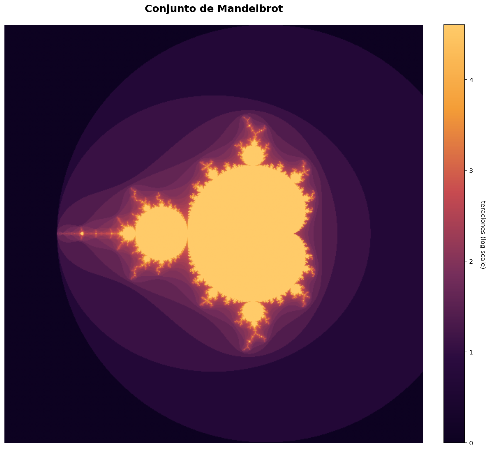
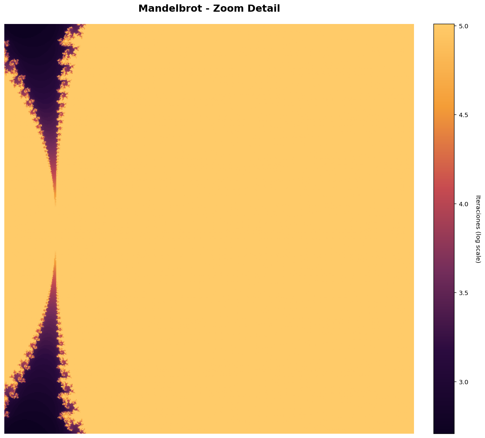
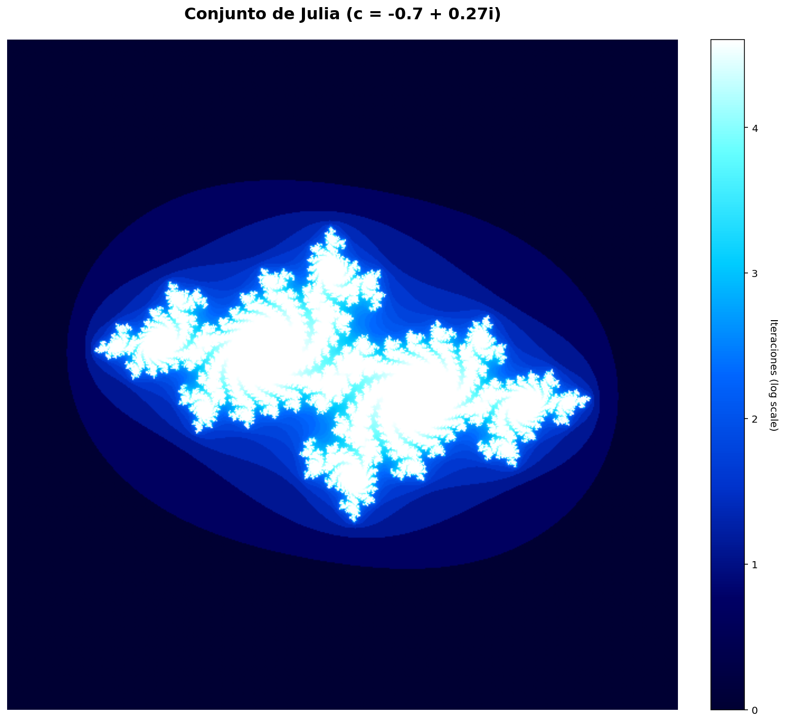
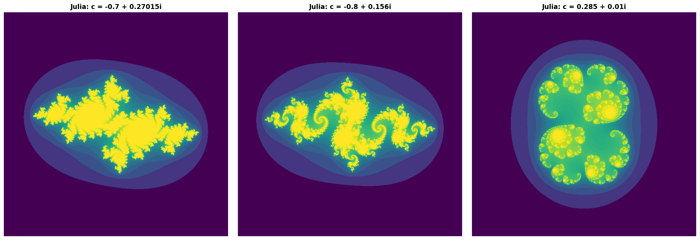
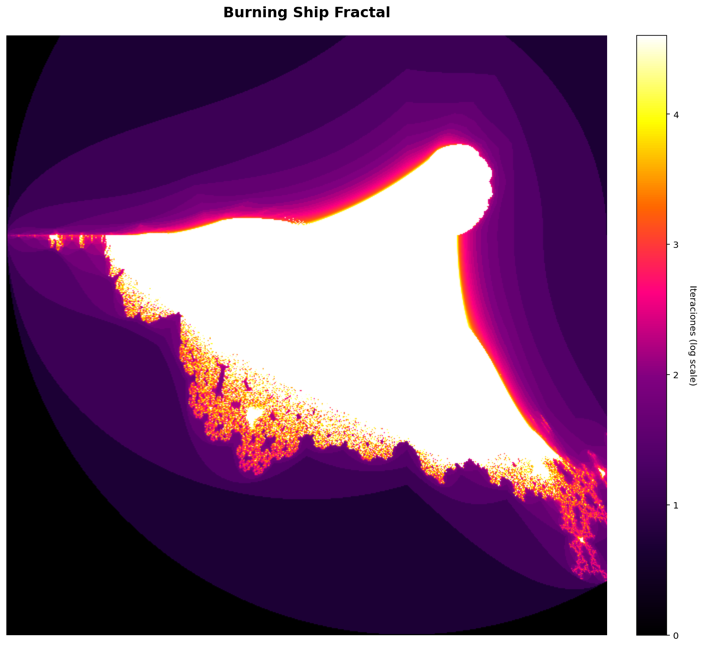
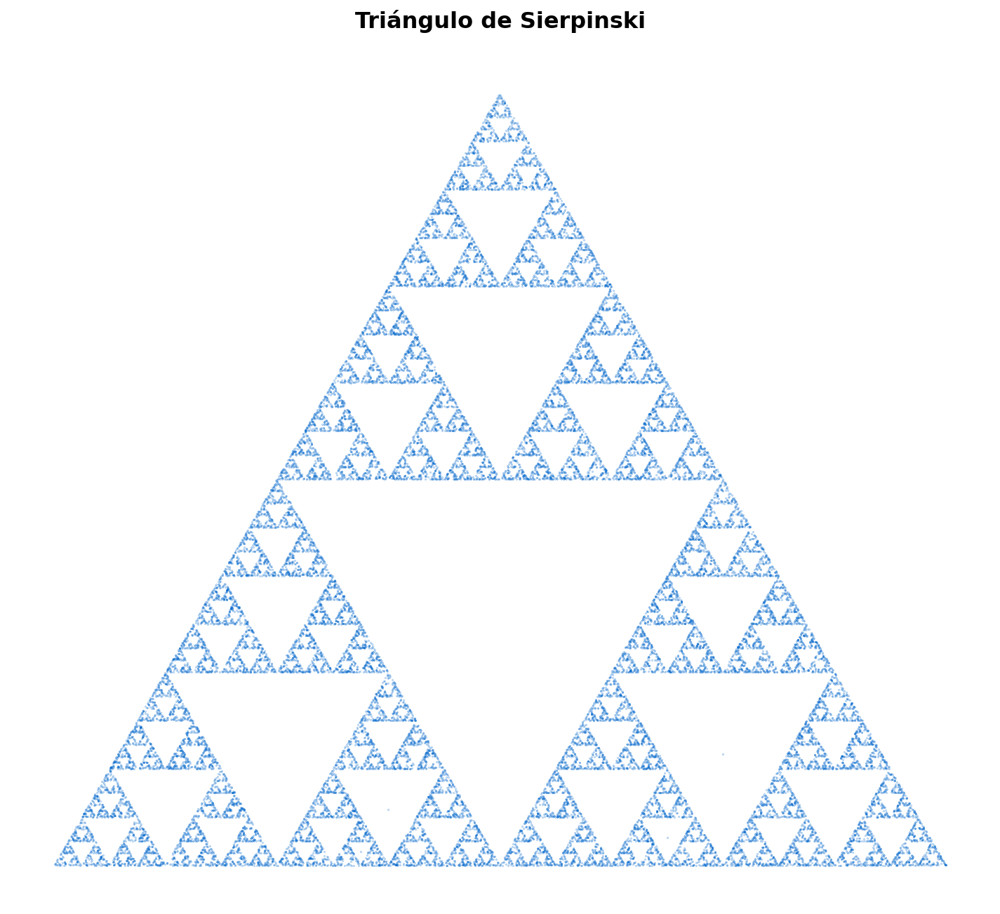

# Fractal Generator - Interactive Zoom Explorer

Advanced Python project for mathematical visualization and analysis of fractals with infinite zoom capability.

## 🎨 Features

- **4 Fractal Types:** Mandelbrot Set, Julia Set, Burning Ship, Sierpinski Triangle
- **Interactive Zoom:** Real-time recalculation with no pixelation
- **Mathematical Analysis:** Entropy, fractal dimension, variance calculations
- **Professional Visualizations:** PNG (300 DPI) + interactive HTML exports
- **Web Interface:** Flask-based explorer with controls

## 📊 Visualizations Included

### Mandelbrot Set


### Mandelbrot Zoom Detail


### Julia Sets


### Julia Sets Comparison


### Burning Ship Fractal


### Sierpinski Triangle



## 📐 Mathematical Foundation

### Mandelbrot Set
$$Z_{n+1} = Z_n^2 + C$$

Each point C in the complex plane is colored by iteration count until divergence.

### Julia Set
$$Z_{n+1} = Z_n^2 + C \text{ (C is constant)}$$

Generates unique fractal patterns for different C values. Classic examples included.

### Burning Ship
$$Z_{n+1} = (|Re(Z_n)| + i|Im(Z_n)|)^2 + C$$

Asymmetric fractal created by applying absolute values before squaring.

### Sierpinski Triangle
Generated via the Chaos Game method - demonstrates perfect self-similarity through iteration.

## 🚀 Quick Start

### Installation

```bash
# Using pip
pip install numpy matplotlib plotly kaleido flask

# Using conda (recommended)
conda create -n fractals python=3.10
conda activate fractals
conda install numpy matplotlib plotly kaleido flask
```

### Static Generator

Generate all fractals automatically with analysis:

```bash
python scripts/fractal_generator.py
```

**Output:**
- 300 DPI PNG images
- Interactive HTML plots
- Mathematical analysis (entropy, dimension, variance)
- Files saved to `fractal_outputs/`

### Interactive Explorer (RECOMMENDED)

Infinite zoom explorer with real-time recalculation:

```bash
python scripts/fractal_flask_zoom.py
```

Opens at `http://localhost:5000`

**Controls:**
- Drag to zoom into regions
- Double-click to reset
- Slider: Adjust iterations (50-500)
- Dropdown: Switch fractals
- Button: Save high-resolution PNG

## 📖 How It Works

1. **Zoom Detection:** Mouse coordinates capture desired region
2. **Recalculation:** Flask recalculates fractal for new bounds at 800x800 resolution
3. **Rendering:** Real-time plot update with no pixelation
4. **Export:** Save production-ready 1920x1080 PNG

## 🔍 Interpreted Metrics

**Entropy:** Randomness and complexity of the fractal distribution

**Fractal Dimension:** Self-similarity measure (typically 1.5-2.0 for classic fractals) - box-counting method

**Variance:** Distribution spread - higher variance = more varied structure

**Fill Ratio:** Percentage of plane occupied by fractal set

## 💡 Use Cases

- Numerical analysis of iterative algorithms
- Scientific visualization in research
- Educational tool for complex numbers and dynamics
- Algorithm optimization with NumPy vectorization
- Web development with Flask + Plotly

## 📁 Project Structure

```
fractals/
├── scripts/
│   ├── fractal_generator.py       # Static batch generator
│   └── fractal_flask_zoom.py      # Interactive web explorer
├── fractal_outputs/               # Generated PNG + HTML
└── README.md
```

## ⚠️ Troubleshooting

**"No module named 'kaleido'"**
```bash
pip install -U kaleido
```

**"Address already in use" (Flask)**
Change port in `fractal_flask_zoom.py`:
```python
app.run(port=5001)
```

**Slow generation**
- Reduce resolution: `width=600, height=600`
- Lower iterations: `max_iter=100`

## 🛠️ Technologies

- **Python 3.8+**
- **NumPy** - Vectorized complex number calculations
- **Matplotlib** - Static visualizations
- **Plotly** - Interactive plots
- **Flask** - Web interface
- **Kaleido** - PNG export from Plotly

## 📚 References

- [Mandelbrot Set Theory](https://en.wikipedia.org/wiki/Mandelbrot_set)
- [Julia Sets](https://en.wikipedia.org/wiki/Julia_set)
- [Fractal Dimension](https://en.wikipedia.org/wiki/Fractal_dimension)

## Author

**Verónica Serrano**  
Computational Mathematics | Data Analysis | Scientific Visualization

---

*This project demonstrates proficiency in mathematical modeling, algorithm optimization, scientific computing, and Python architecture.*
